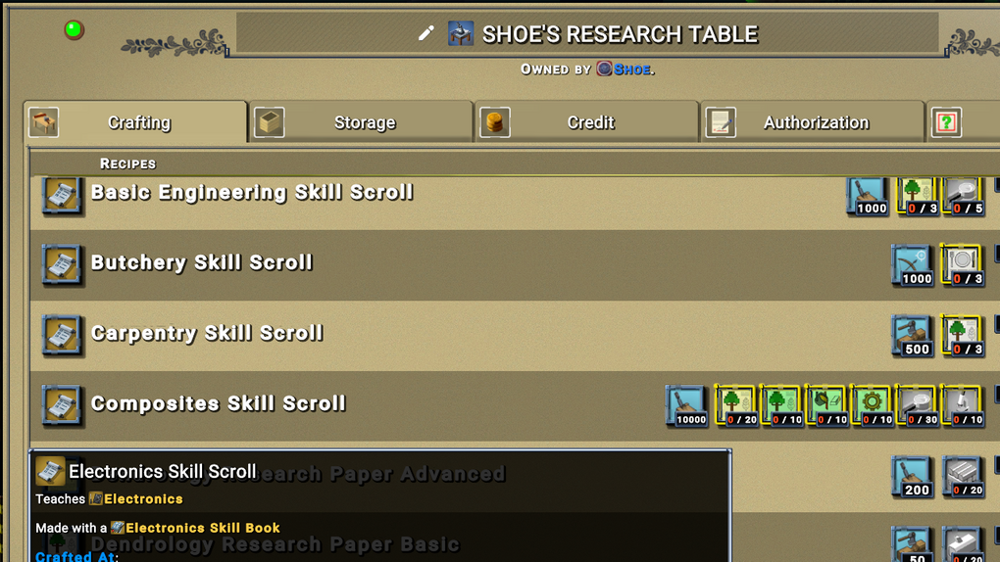

No More Books Mod for ECO
=========================

Tired of players getting a book from the research table just to hand scrolls out to everyone? Want to make your server more challenging? This mod will not allow books to be made on the research table, only scrolls, thus stopping players from making too many scrolls and giving them away.

This is an updated version of the No More Books Mod available <a href="https://eco.mod.io/no-more-books-mod">here</a>

## Installation

Place and overwrite the files in ``Mods\AutoGen\Tech\`` with the files found in the ``source`` folder of this repository.

<b>Be sure and backup the files before you overwrite them.</b>

## License

The No More Books Mod for Eco is available under the MIT license. A copy of this license can be found in the repository root or <a href="https://github.com/thetestgame/Eco-No-More-Books-Mod/blob/master/LICENSE">here</a>